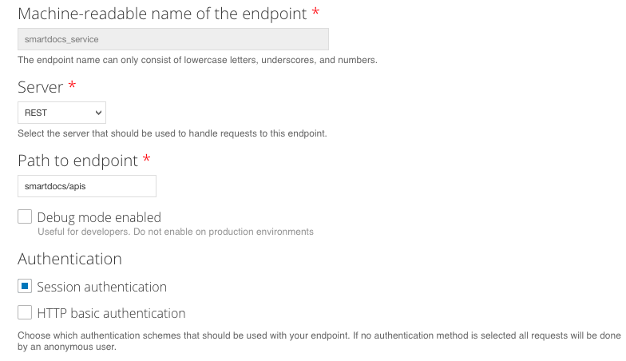
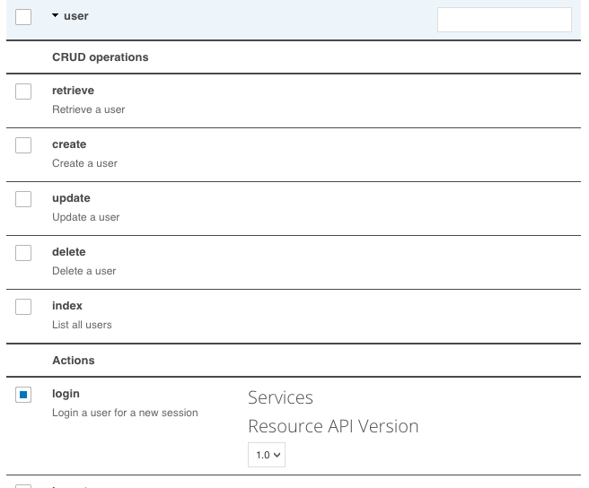

# Samples

## Prerequisites (Developer Portal setup)

**To utilize this example, you will need a working developer portal instance with the [smartdocs_service module](https://github.com/apigeecs/smartdocs_service) installed and enabled. That module will expose endpoints for use by the SmartDocs Maven Plugin. For advanced configuration/setup please consult an expert. See [here](https://www.drupal.org/docs/7/extending-drupal-7/installing-drupal-7-contributed-modules#import_mod--manual) for more information on installing modules into the Developer Portal. **

When the module has been installed in the codebase, go to http://[yoursite.com]/admin/modules, select the smartdocs_service module and click "Save configuration". This will enable your module. 

When smartdocs_service module is installed and enabled, you should see 1 available service labeled smartdocs_service on the page located at http://[yoursite.com]/admin/structure/services.

### Service Listing


From this page, first, click the down arrow by "Edit Resources" and choose "Edit".

### Service Edit



Note the "Path to endpoint" field. The value set here is what we will set in the pom.xml as the "portal.path" value. You can change this value, so long as you note it for use in the pom.xml file

You will need to change Authentication from "HTTP basic authentication" to "Session authentication as depicted in the image above.

### Resource Edit


Leave all smartdocs endpoints enabled. The Smartdocs Maven Plugin makes use of all but queue_status and index at present. DELETE and DO NOT ADD any aliases -- utilizing an alias will cause the system not to function.



Enable the user login endpoint. This will us to authenticate against the system and perform updates.

Note that it is recommended that you create a special user for the integration and limit the permissions of the user accordingly. 

### Resource Edit (Advanced implementation)

If you plan to followed the advanced implementation model and import metadata with your models, you will need to enable the taxonomy_term update endpoint and the retrieveMachineName and getTree endpoints as depicted in the image below.


## DevPortal

### Basic Implementation (Model import)

**Please ensure all prerequisites have been followed prior to continuing.**

Goal: Create models and import OpenAPI specs to a developer portal instance.

```
/samples/DevPortal
```

This project demonstrates use of apigee-smartdocs-maven-plugin to create models and import OpenAPI specs to a developer portal. The example project performs a data import defined in pom.xml

To use, edit samples/DevPortal/pom.xml and update portal values as specified.

      <portal.username>${pusername}</portal.username><!-- Username for the developer portal. -->
      <portal.password>${ppassword}</portal.password><!-- Password for the developer portal. -->
      <portal.directory>${pdirectory}</portal.directory><!-- Directory whered OpenAPI specs are accessible. -->
      <portal.url>${purl}</portal.url><!-- URL of the developer portal. -->
      <portal.path>${ppath}</portal.path><!-- Servies path defined in the developer portal. -->
      <portal.format>json</portal.format><!-- Format of the OpenAPI specs. -->

To run, jump to the sample project `cd /samples/DevPortal` and run 

`mvn install -Pdev -Dapigee.smartdocs.config.options=create`


### Advanced Implementation (Model metadata import)

**Please ensure the prerequisites and basic implementation have been followed prior to continuing.**

Goal: Add field data to models in a developer portal instance.

```
/samples/DevPortal
```

This project demonstrates use of apigee-smartdocs-maven-plugin to add field data to a model in a developer portal. The example project performs a data import defined in shared-pom.xml

To use, edit samples/DevPortal/shared-pom.xml, uncomment, and update portal values as needed.

    <configuration>
        <portal.model.vocabulary>${model_vocabulary}</portal.model.vocabulary>
        <portal.model.fields>
            <company>
                <path>contact|company</path>
                <field>field_company</field>
            </department>
        </portal.model.fields>
    </configuration>

The path value signifies the path to data stored within the info object. 
The pipe character can be used to traverse into sub-items. For instance, with a OpenAPI document containing  { "info": { "contact": { "company": "Google" } } }, you could be access the data by setting the path to contact|company.
In the example above, "Google" would be mapped to the field_company field within the model related to the OpenAPI document definition.

Example of a field_company value set within the OpenApi specification:


Before using, you will need to create fields on the smartdocs_model taxonomy page within the developer portal. field_company would relate to a field your create on the page located at http://[yoursite.com]/admin/structure/taxonomy/smartdocs_models/fields. Note that the current sytem currently only supports the Field type of "Text".


To run jump to samples project `cd /samples/DevPortal` and run 

`mvn install -Pdev -Dapigee.smartdocs.config.options=create`


### Troubleshooting

#### 404 Error
Validate that the module is installed and enabled and that resource endpoints are set as described in the prerequisites. If you are still encountering errors, try downloading an app such as [Postman](https://www.getpostman.com/) and making a direct request to endpoints defined on the service endpoint page.

#### Handshake_failure
If you receive a handshake failure, it is likely an issue with TLS mismatch between your machine and the server. Add the following to the end of the `mvn install ...` line: `-Dhttps.protocols=TLSv1.2`

e.g. `mvn install -Pdev -Dapigee.smartdocs.config.options=create -Dhttps.protocols=TLSv1.2`

#### Render error
While the system is capable of telling the Developer Portal to "render" the content - making them visible to end users - the Developer Portal will not render the content until after a "cron" run has occurred. If you believe the content should be rendered and it has not, please validate that cron has run 